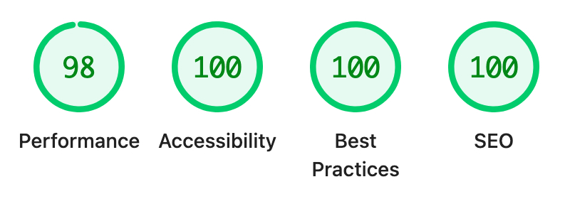
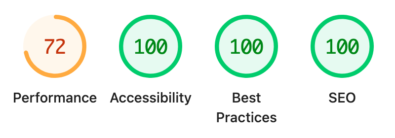

# smart-form

Nuxt 3（Vue 3）と vee-validate / Yup による**会員登録フォーム**の実装デモです。入力 → 確認 → 完了の流れ、郵便番号からの住所補完、LocalStorage 下書き、アクセシビリティ配慮（ラベル、フォーカス、エラー表示など）を含みます。

## デモURL
https://enaosuke.github.io/smart-form/

## 技術スタック

- [Nuxt 3](https://nuxt.com/) / Vue 3
- [vee-validate](https://vee-validate.logaretm.com/) + [Yup](https://github.com/jquense/yup)
- Sass（グローバルスタイル）
- Font Awesome（アイコン）
- Storybook（コンポーネント開発用）

## Lighthouse（2026年3月24日）

### Desktop

### Mobile

## ライセンス・免責

このリポジトリは登録処理はダミーであり、実サービスへの接続は行いません。
